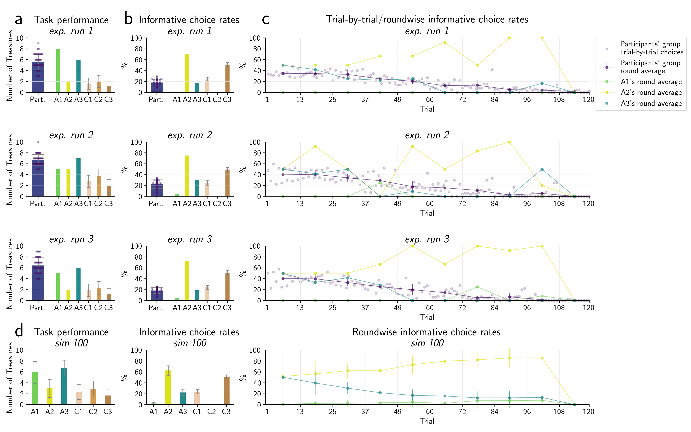

# Treasure Hunt
---
*NOTE:*  All contents in this repo are still work in progress and incomplete

---
## Table of contents
- [General Info](#general-info)
- [Treasure Hunt task](#treasure-hunt-task)
- [Task BehavioralModel](#task-model)
- [Agent Models](#agent-models)
- [Simulations](#simulations)
- [Data Analyses](#data-analyses)
- [References](#references)


## General Info 
This repository contains all scripts and tools to run the [treasure hunt task](#treasure-hunt-task), simulations with a corresponding [task model](#task-model) and [agent models](#agent-models) and [data analyses](#data-analyses).

The current state of the code only works with ```python version 3.8.2```
## Treasure Hunt task
The Treasure Hunt task is behavioral paradigm that presents a spatial search problem with an exploration-exploitation dilemma

Script to run the rask: [run_task.py](https://github.com/belindamef/my_master_project/blob/main/code/run_task.py)


**a. Task design. b. Trial layout**

## Task BehavioralModel
The model of the task is formulated using concepts from the theory of partially observable Markov decision processes (PoMDP) [[1]](#references)


* Task model class [task.py](code/utilities/task.py)
## Agent Models
* Agent model class: [agent.py](code/utilities/agent.py)
* BehavioralModel components (prior and likelihood arrays): [model_comp.py](code/utilities/model_comp.py)

## Simulations

* Script to run simulation [run_simulation.py](code/run_simulation.py)
* method to simulate agent-task interaction: [agent_task_interaction.py](code/utilities/simulation_methods.py)


**a. Graph model. b. Agent-Task-Interaction**

## Data Analyses

* Scrip to run stats: [run_descriptives.py](code/run_descriptives.py)
* Script to plot figures: [plot_figures.py](code/plot_figure_1.py)



**Human and agent behavioral results**

## References
[1] Bertsekas, D. P. (2005)._Dynamic Programming and Optimal Control_.Belmont, Mass: AthenaScientific, 3rd edition


